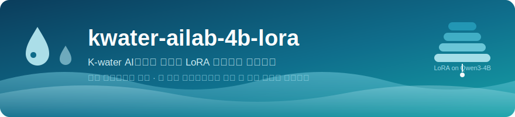
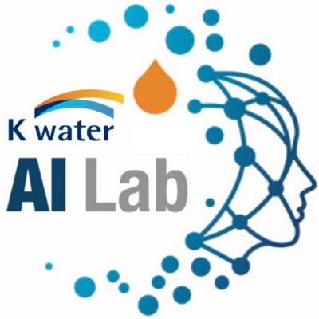
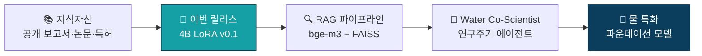
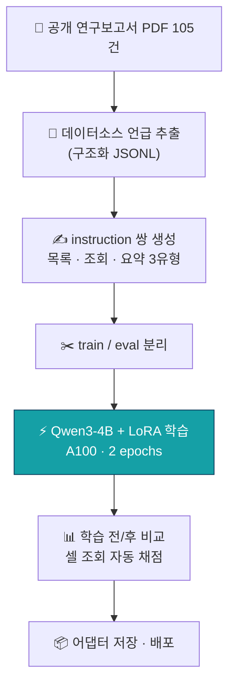

<p align="center">
  
</p>

<p align="center">
  
</p>

<p align="center">
  
  
  
  <a href="https://huggingface.co/newcave/kwater-ailab-4b-lora"></a>
</p>

<p align="center">
  
  
  
  
  
  
</p>

---

## 💧 이 모델은 무엇인가

> **"K-water 공개 연구보고서를 활용한, 물 특화(Water-Specialized) 파운데이션을 향한 첫 번째 가중치 업데이트."**

**kwater-ailab-4b-lora**는 K-water AI연구소가 **처음으로 자체 파인튜닝한 언어모델**(LoRA 어댑터)입니다.
ALIO 공개 연구보고서 105건에서 추출한 **데이터소스 언급(datasource mentions)** 구조화 데이터를 학습하여,
*"어떤 연구에서 · 어떤 데이터가 · 어느 기관으로부터 · 어떻게 활용되었는가"* 를 **출처와 함께** 답하도록 조정되었습니다.

이 어댑터는 완성형 모델이 아니라 **여정의 v0.1**입니다 — 목표 지점은 물관리 도메인의 지식과 어휘를 갖춘
**물 특화 언어모델**이고, 이 리포는 그 첫 가중치 업데이트의 기록입니다.

## 🧭 Water Co-Scientist 구상 속의 위치

이 모델은 K-water **Water Co-Scientist**(연구주기 에이전트 체계) 구상의 첫 기술 검증(PoC)입니다.



## 📋 모델 카드

| | |
|---|---|
| 🧱 **베이스 모델** | [Qwen/Qwen3-4B-Instruct-2507](https://huggingface.co/Qwen/Qwen3-4B-Instruct-2507) (Apache 2.0) |
| 🔧 **방법** | LoRA — r=16, alpha=32, 전체 선형층, bf16, 2 epochs |
| 📄 **학습 데이터** | 공개 연구보고서 105건의 데이터소스 레코드 → 규칙 기반 instruction 쌍 (목록 나열 · 필드 조회 · 카드 요약) |
| ⚡ **학습 환경** | Google Colab Pro+ · NVIDIA A100 40GB · Unsloth + TRL |
| 📦 **산출물** | LoRA 어댑터 (수십 MB) — 베이스 모델 위에 장착 |
| 🤗 **가중치** | [huggingface.co/newcave/kwater-ailab-4b-lora](https://huggingface.co/newcave/kwater-ailab-4b-lora) ✅ 공개중 |

## 🚀 빠른 시작

```python
from peft import PeftModel
from transformers import AutoModelForCausalLM, AutoTokenizer

BASE = "Qwen/Qwen3-4B-Instruct-2507"
ADAPTER = "newcave/kwater-ailab-4b-lora"   # 🤗 공개 어댑터

tok = AutoTokenizer.from_pretrained(BASE)
model = AutoModelForCausalLM.from_pretrained(BASE, torch_dtype="bfloat16", device_map="auto")
model = PeftModel.from_pretrained(model, ADAPTER)

q = "「AR6 SSP 기후변화 시나리오 기반 다목적댐 홍수방어기준 개선 연구」에서 사용된 데이터 소스를 나열하시오."
msgs = [{"role": "user", "content": q}]
inputs = tok.apply_chat_template(msgs, add_generation_prompt=True, return_tensors="pt").to(model.device)
out = model.generate(inputs, max_new_tokens=256, do_sample=False)
print(tok.decode(out[0][inputs.shape[1]:], skip_special_tokens=True))
```

▶ 전체 예시: [`scripts/inference_demo.py`](scripts/inference_demo.py)

## 🔬 학습 파이프라인



같은 데이터의 인벤토리 대시보드: 🖥️ [**rnddata_report**](https://github.com/newcave/rnddata_report)

## ⚠️ 한계 (정직 고지)

- 🔬 **v0.1 기술 검증 버전** — 학습쌍이 규칙 기반 템플릿으로 생성되어 표현 다양성이 제한적입니다.
  모델이 학습한 것은 폭넓은 사실 암기가 아니라 **응답 형식(출처 표기)과 도메인 어투**에 가깝습니다.
- 🔍 사실 조회가 중요한 실사용에서는 단독 사용이 아니라 **RAG 파이프라인의 생성 슬롯** 장착을 전제로 합니다.
- 🌫️ 학습 범위(105건 보고서) 밖 질문에는 베이스 모델의 일반 능력으로 답하며, 환각이 발생할 수 있습니다.

## 🗺️ 로드맵

| 단계 | 내용 | 상태 |
|---|---|---|
| v0.1 | 규칙 기반 QA · 파이프라인 검증 (이번 릴리스) | ✅ |
| v0.2 | 🤖 LLM 생성 고품질 QA로 재학습 (표현 다양화) | 🔜 |
| v0.3 | 📏 홀드아웃 일반화 평가 + LogicKor 회귀 확인 | ⬜ |
| v0.4 | 🔗 RAG(bge-m3+FAISS) 생성 슬롯 장착 · RAGAS 비교 | ⬜ |
| v1.x | 🌊 코퍼스 확장 (OpenAlex 논문 · KIPRIS 특허) → 물 특화 모델 | ⬜ |

## 📜 라이선스 · 인용

어댑터·코드·베이스 모델 모두 **Apache 2.0**.

```bibtex
@misc{kwater-ailab-4b-lora,
  title  = {kwater-ailab-4b-lora: The first LoRA fine-tuned LM of K-water AI Research Institute},
  author = {K-water AI Research Institute},
  year   = {2026},
  url    = {https://github.com/newcave/kwater-ailab-4b-lora}
}
```

---

<p align="center">
  💧 <b>K-water AI연구소</b> · Water Co-Scientist 프로젝트 · 2026<br/>
  <sub>물 특화 파운데이션을 향한 첫 번째 가중치 업데이트</sub>
</p>
